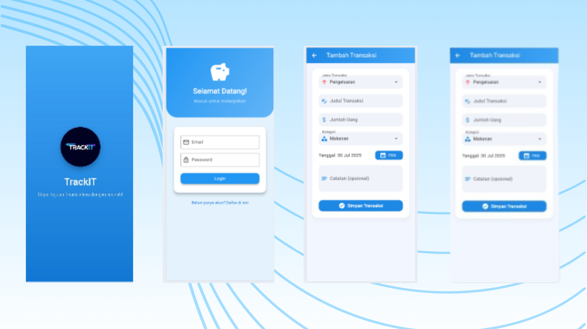

# TrackIt Mobile App

**TrackIt** is a modern Flutter application designed to help users track daily financial transactions effortlessly. With TrackIt, users can manage income and expenses, visualize spending patterns, and gain insights into their finances through intuitive charts.

## Table of Contents

- [Features](#features)  
- [Screenshots](#screenshots)  
- [Project Structure](#project-structure)  
- [Getting Started](#getting-started)  
- [Installation](#installation)  
- [Usage](#usage)  
- [State Management](#state-management)  
- [Contributing](#contributing)  
- [Resources](#resources)  

## Features

- **Add, View, and Delete Transactions:** Keep track of income and expenses easily.  
- **Automatic Balance Calculation:** The app calculates your current balance in real-time.  
- **Visual Statistics:** Analyze your finances with intuitive charts and graphs.  
- **Filter by Date:** Quickly view transactions from specific dates or periods.  
- **Simple and Intuitive UI:** Modern design for easy navigation and interaction.  
- **State Management:** Powered by `Provider` for efficient and reactive state updates.  

## Screenshots



## Project Structure

- **`lib/main.dart`**: Entry point of the app  
- **`lib/models/transaction.dart`**: Data model for transactions  
- **`lib/providers/transaction_provider.dart`**: State management using Provider  
- **`lib/screens/`**: Contains main screens of the app  
- **`lib/widgets/`**: Reusable UI components (list, chart)  

## Getting Started

These instructions will help you set up the project locally for development and testing purposes.

### Prerequisites

- Flutter SDK >= 3.0.0  
- Dart >= 3.0.0  
- Android Studio or VS Code  
- Emulator or physical device for testing  

### Installation

1. **Clone the repository:**  
```bash
git clone https://github.com/yourusername/trackit.git
cd trackit
