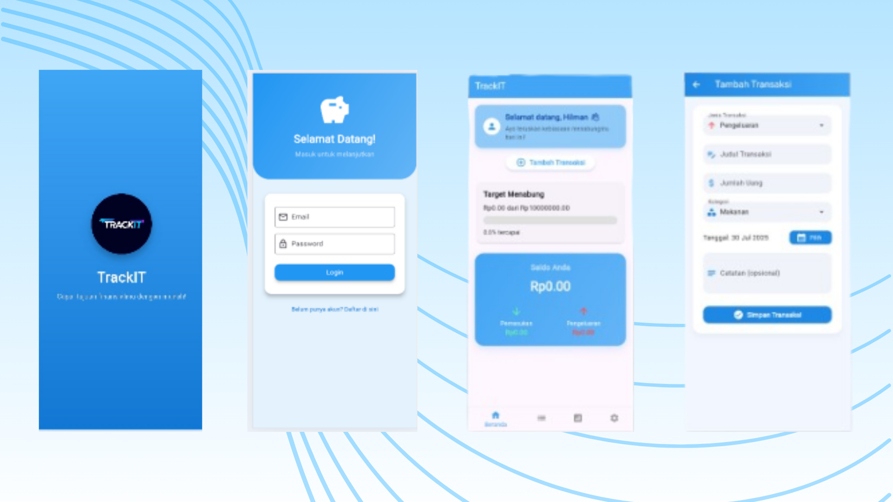

# TrackIt Mobile Apps

TrackIt is a simple and modern Flutter application for tracking daily financial transactions. Users can record income and expenses, view transaction history, and analyze financial summaries using charts.

## Getting Started

This project is a starting point for a Flutter financial tracking application.

### App Preview

### Features

- Add, view, and delete income/expense transactions
- Calculate balance automatically
- Visual statistics using charts
- Filter transactions by date
- Simple and intuitive UI
- State management with Provider

A few resources to get you started if this is your first Flutter project:

- [Lab: Write your first Flutter app](https://docs.flutter.dev/get-started/codelab)
- [Cookbook: Useful Flutter samples](https://docs.flutter.dev/cookbook)

For help getting started with Flutter development, view the  
[online documentation](https://docs.flutter.dev/), which offers tutorials,  
samples, guidance on mobile development, and a full API reference.
